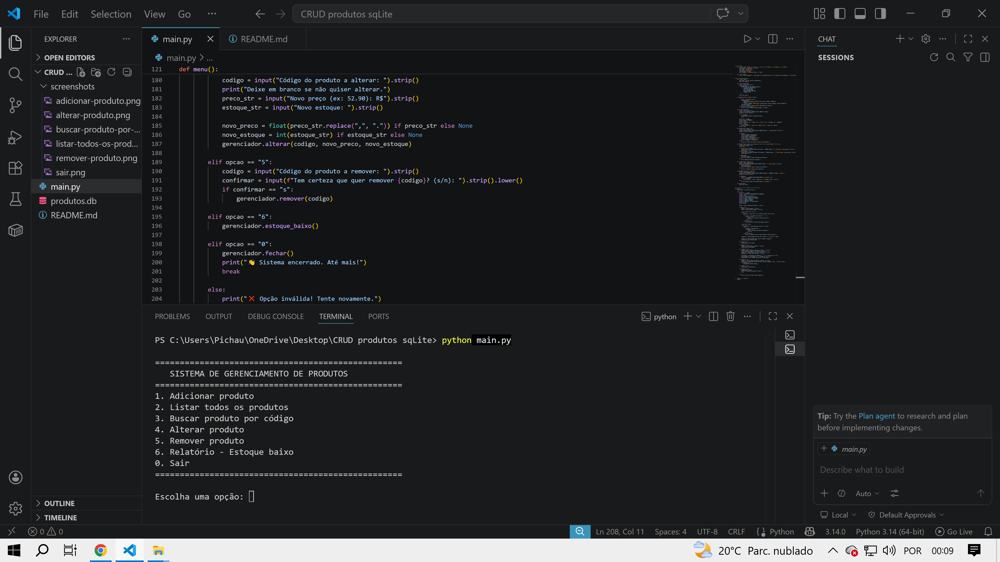
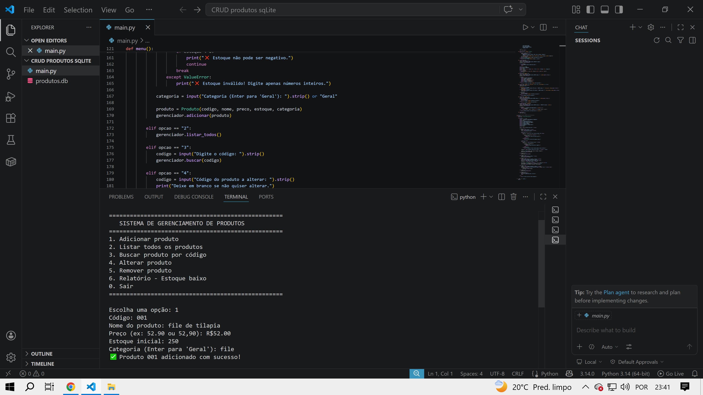
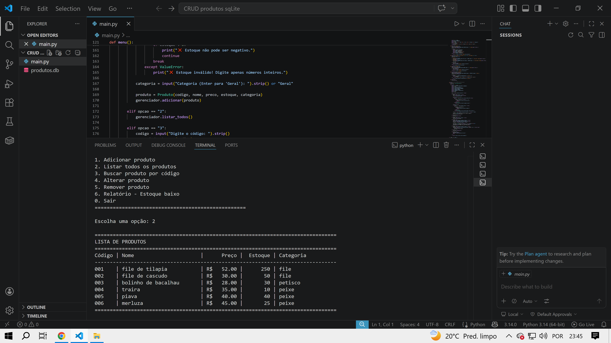
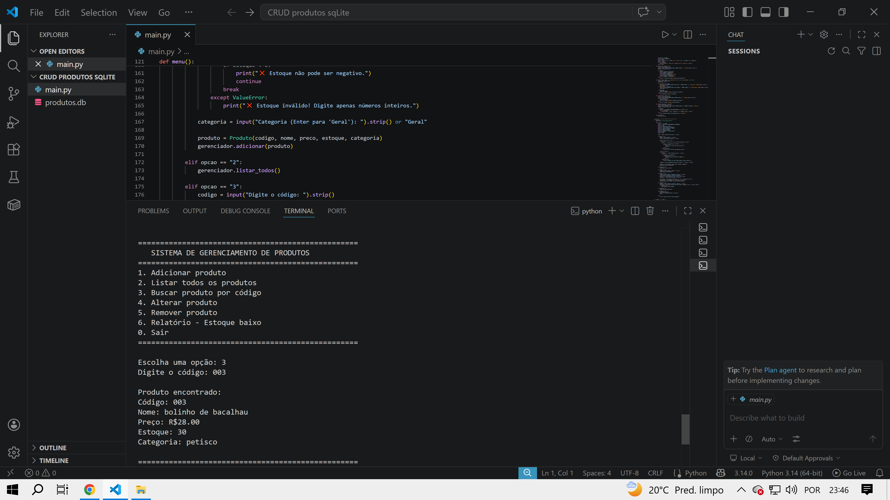
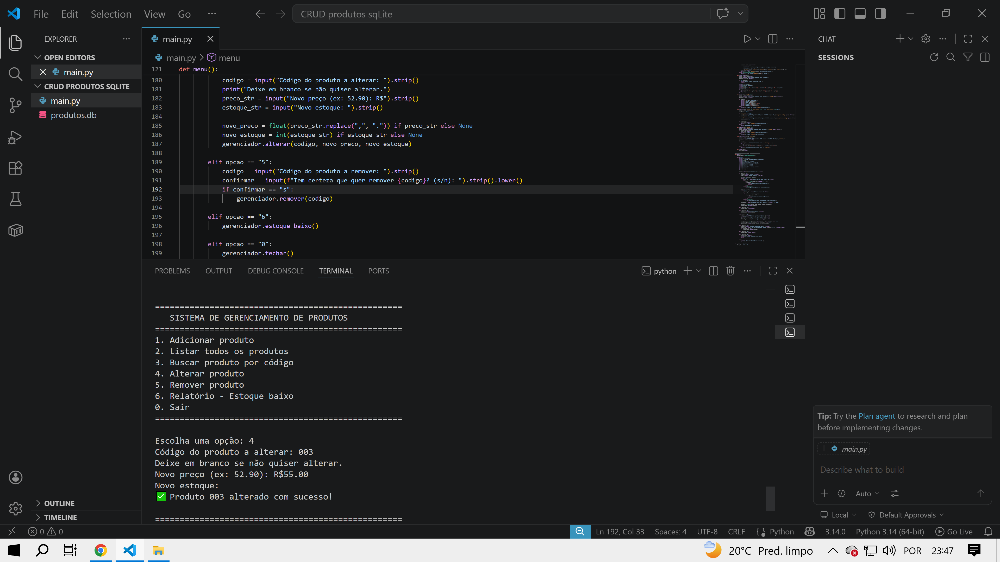
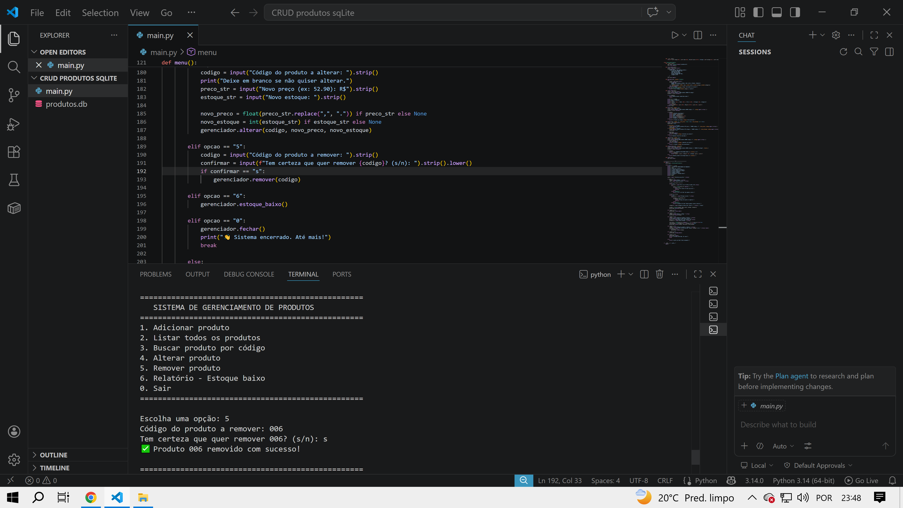

# Sistema de Gerenciamento de Produtos (CRUD)

Um sistema completo de cadastro e gerenciamento de produtos desenvolvido em Python com banco de dados SQLite.

## 🎯 Sobre o Projeto

Este projeto foi desenvolvido como parte do meu aprendizado em **Programação Orientada a Objetos** e persistência de dados.  
O sistema permite gerenciar um estoque de produtos com todas as operações básicas de um CRUD.

## ✨ Funcionalidades

- ✅ Adicionar novos produtos
- ✅ Listar todos os produtos (com formatação organizada)
- ✅ Buscar produto por código
- ✅ Alterar preço ou estoque de um produto
- ✅ Remover produto
- ✅ Relatório de produtos com estoque baixo
- ✅ Validações de entrada (preço > 0, estoque ≥ 0, campos obrigatórios)
- ✅ Tratamento de erros (código duplicado, entradas inválidas, etc.)

## 🛠️ Tecnologias Utilizadas

- **Python 3** - Linguagem principal
- **SQLite** - Banco de dados leve e embutido
- **Programação Orientada a Objetos (POO)** - Uso de classes e objetos
- **Tratamento de exceções** - `try` / `except` para maior robustez

## 📸 Demonstração

### Menu Principal


### Adicionar Produto


### Listagem de Produtos


### Buscar Produto


### Alterar Produto


### Remover Produto

## 🚀 Como Rodar o Projeto

1. Clone este repositório:
   ```bash
   git clone https://github.com/Darlontoebe/crud_produtos_sqlite.git
